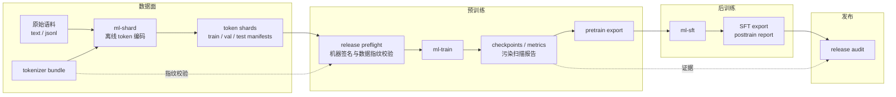
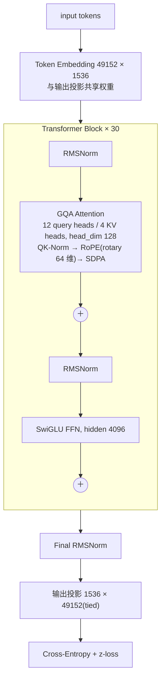
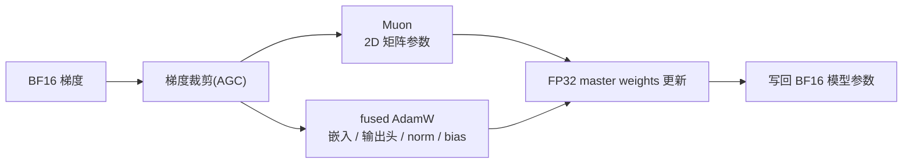
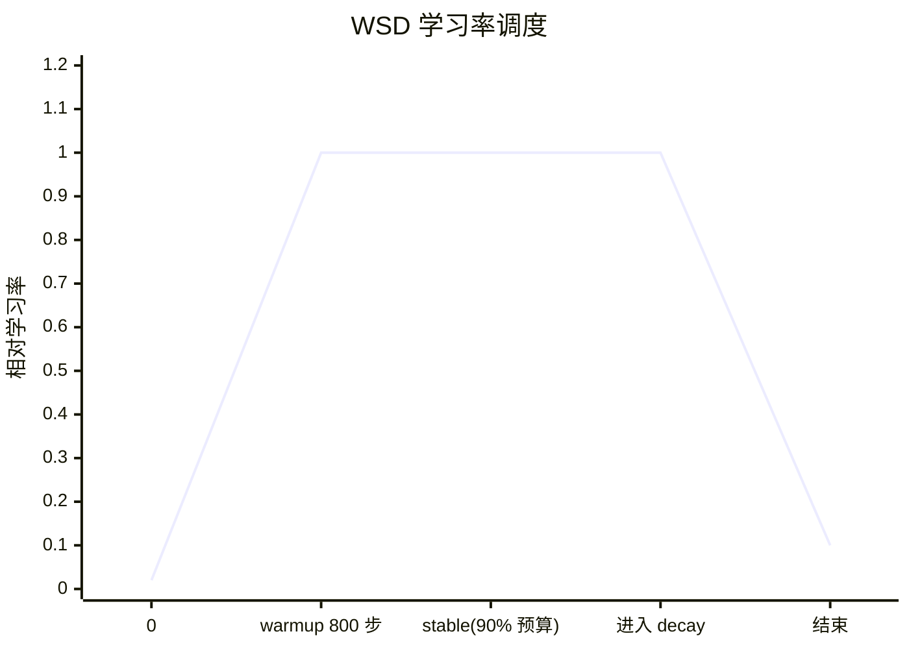
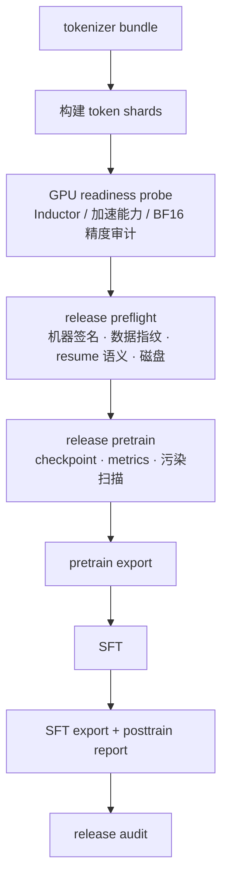

# Sophia


Sophia 是一个语言模型训练系统,覆盖从原始语料到可发布模型的完整链路:tokenizer 与 token shard 数据构建、decoder 模型实现、预训练、监督微调(SFT)、模型导出、本地推理评测,以及贯穿各阶段的发布审计(release gate)。仓库中的默认模型为约 0.83B 参数的 decoder causal LM,训练窗口 4096,面向单张 NVIDIA GeForce RTX 5090 以 BF16 精度训练。

系统设计遵循两条原则。其一,训练配置以签名后的 machine recipe 形式固化于仓库:batch 几何、算子后端与精度策略均与目标机器的硬件签名绑定,启动前校验签名一致性,以保证训练结果可复现、可追溯。其二,各训练阶段定义了明确的输入、必需产物与失败边界,发布审计校验的对象是完整的工程证据链——数据指纹、机器签名、checkpoint、评测报告——而非单一的完成状态。

## 目录

1. [系统概述](#1-系统概述)
2. [模型架构](#2-模型架构)
3. [训练方法](#3-训练方法)
4. [数据](#4-数据)
5. [工程实现与可复现性](#5-工程实现与可复现性)
6. [使用方法](#6-使用方法)
7. [仓库结构](#7-仓库结构)

## 1. 系统概述

系统由四个部分组成:数据面、预训练、后训练与发布审计。阶段之间通过内容指纹(tokenizer bundle 与 manifest 的 sha1)和机器签名衔接,任一环节的不一致都会在下一阶段启动前被检出。



*图 1:系统总体结构。虚线表示指纹与证据的校验关系。*

模型实现分为三层:`ml/core/spec/model.py` 中的 `ModelSpec` 定义模型规格并作为唯一定义源;`SophiaDecoderConfig` 承载训练、保存与导出所需的配置;`ml/runtime/model/` 为自包含的运行时实现,包含 forward、KV cache 与注意力计算。规格通过投影函数派生到各层配置对象,避免同一语义的多处定义。

## 2. 模型架构

### 2.1 整体结构

模型为 decoder causal LM,由 30 层 pre-norm Transformer block 组成,残差结构为 `x = x + Attention(RMSNorm(x))`、`x = x + FFN(RMSNorm(x))`。词嵌入与输出投影共享权重(tied embeddings),主路径上所有线性层均不含 bias。



*图 2:模型结构。*

默认规格如下表所示。

| 字段 | 值 | 字段 | 值 |
| --- | ---: | --- | ---: |
| 参数量 | ≈ 0.83B | `ffn_hidden` | 4096 |
| `vocab_size` | 49152 | `max_seq_len` | 4096 |
| `dim` | 1536 | `rope_head_dim` | 64 |
| `n_layers` | 30 | `rope_theta` | 500000.0 |
| `n_heads` | 12 | `norm_eps` | 1e-6 |
| `num_key_value_heads` | 4 | `dropout` | 0.0 |
| `head_dim` | 128 | QK-Norm | 启用 |

*表 1:默认模型规格(`ModelSpec.default()`)。*

### 2.2 注意力

注意力采用分组查询注意力(GQA),12 个 query head 对应 4 个 key-value head,每个 head 维度 128。因果注意力为精确计算,经 PyTorch `scaled_dot_product_attention` 调用,发布配方固定使用 Flash 后端;未引入稀疏、滑窗或线性近似。Q/K/V/O 投影均为 bias-free 线性层。

Q 与 K 在重排到 head 维度后各自经过 RMSNorm(QK-Norm),随后施加旋转位置编码。该顺序约束了注意力 logits 的尺度,是 BF16 精度下长时间训练稳定性的组成部分。KV cache 仅用于推理阶段的增量解码;训练路径不依赖 cache。

### 2.3 位置编码

位置编码采用部分维度 RoPE:仅旋转每个 head 内最后 64 维(`rope_head_dim = 64`),base 取 `rope_theta = 500000`。`original_seq_len = 0` 表示标准训练窗口语义,训练窗口为 4096。

### 2.4 前馈网络与归一化

前馈网络为 SwiGLU 结构,计算式为 `down(silu(gate(x)) ⊙ up(x))`,隐层维度 4096,激活函数为 SiLU。全模型统一使用 RMSNorm(`eps = 1e-6`),包括 QK-Norm 与最终输出前的归一化。

### 2.5 初始化与损失

嵌入与常规线性层权重按标准差 0.02 初始化;attention 输出投影与 FFN down 投影按残差深度缩放,标准差为 `0.02 / √(2·n_layers)`。

训练目标为标准 next-token prediction,标签采用 causal shift,ignore index 为 −100。在交叉熵之外附加权重 1e-4 的 z-loss,约束 logits 的 log-partition 以抑制输出分布尺度随训练增长。

## 3. 训练方法

### 3.1 优化器

训练采用 Muon 与 fused AdamW 的混合优化器:2D transformer 矩阵参数使用 Muon(Newton–Schulz 迭代 4 次,目标 RMS 0.18),嵌入、输出头、bias 与归一化参数使用 fused AdamW。



*图 3:混合优化器的每步更新路径。*

模型参数以 BF16 存储和计算,优化器持有 FP32 master weights:每步先将 BF16 梯度同步至 FP32 masters,在 FP32 域完成更新后写回模型参数。采用该设计的原因是,在发布学习率(1e-4)下单步权重更新的量级可能低于 BF16 的半个 ULP,若直接在 BF16 参数上更新,小步长更新会被舍入丢失。

### 3.2 学习率调度与 decay 段数据课程

学习率调度采用 WSD(Warmup–Stable–Decay):800 步线性 warmup,90% 的训练预算维持峰值学习率,其余部分按 cosine 退火至峰值的 10%。嵌入参数的学习率额外缩放 0.25。



*图 4:WSD 调度的学习率轨迹(示意)。*

在调度进入 decay 段的同一步,训练支持切换至高质量数据子集(`--decay_data_path`):切换步由调度器的同一公式(`warmup + stable`)推导,stage planner 在该步拆分训练阶段并切换 manifest。decay 数据由 mix 管线以 `pretrain_decay` preset 构建(1.6B token 配额,books/wiki/math 加权),其 manifest sha1 计入数据签名,断点恢复时逐项复验。

预训练默认超参数如下。

| 超参数 | 值 | 超参数 | 值 |
| --- | ---: | --- | ---: |
| 每次更新 token 预算 | 270,336 | LR 调度 | WSD |
| 峰值学习率 | 1e-4 | warmup | 800 步 |
| weight decay | 0.05 | stable 占比 | 0.9 |
| β₁ / β₂ | 0.9 / 0.95 | 最低 LR 比例 | 0.1 |
| adam ε | 1e-6 | embedding LR 缩放 | 0.25 |
| 梯度裁剪 | AGC, clip 0.01 | Muon NS 迭代 | 4 |

*表 2:发布预训练默认超参数。学习率调整须重新通过目标机 ≥800 步稳定性探针。*

### 3.3 梯度裁剪

发布预训练采用自适应梯度裁剪(AGC),按梯度范数与参数范数之比裁剪(clip 0.01,eps 1e-3),bias 与归一化参数不参与。混合优化器的 `clip_gradients()` 对 Muon 参数执行 global norm 裁剪、对 AdamW 参数执行 AGC,并返回合并后的 pre-clip 梯度范数用于记录。实现同时保留 global norm 与不裁剪模式,供非发布路径使用。

### 3.4 数值精度与执行后端

发布训练栈在目标机上验证后固化,各层选择如下。

| 层面 | 配置 |
| --- | --- |
| 基础精度 | BF16 autocast + FP32 master weights |
| Attention | PyTorch SDPA, Flash 后端 |
| 线性层 | torch(统一经 `RuntimeLinear` 入口) |
| 损失计算 | Liger fused linear CE |
| 逐步执行 | torch.compile Inductor |
| 梯度检查点 | 关闭 |

*表 3:发布精度与执行后端。*

### 3.5 Post-hoc checkpoint 平均

训练期间不维护 EMA(`ema_decay = 0`)。训练结束后,可对最后保存的若干 checkpoint 做权重平均,无额外训练成本:

```bash
PYTHONPATH=. python3 -m ml.tooling.scripts.posthoc_checkpoint_ema \
  --ckpt_dir <run>/checkpoints --last 5 --mode ema --decay 0.7 \
  --output <run>/posthoc_ema.pt
```

输出为标准 checkpoint payload,可直接进入既有导出链路。

### 3.6 监督微调

SFT 从预训练导出的本地模型目录出发,使用多轮对话 JSONL 数据,默认每次更新 16 个样本,学习率 5e-6,weight decay 0.1。长样本按课程处理:长尾阶段(`sft_long_tail`)仅选取长样本,裁剪策略为保留最后一轮(`preserve_final_turn`),约占总更新量的 8%。后训练不改变 tokenizer 与模型架构。

SFT 数据不使用 system persona,样本从 `user` 轮开始;模型的身份与语体来自 assistant 回复的分布,而非 prompt 前缀。

## 4. 数据

数据面包含三种形态:原始语料(text/jsonl,仅作为离线编码输入)、pretrain token shards(发布预训练的唯一训练数据形态)与 post-train chat JSONL(SFT 样本及报告元数据)。

Token shards 由 `ml-shard` 离线编码生成,按 train/val/test 三个 split 组织,每个 split 的 `manifest.json` 记录 shard 路径、token 数、token dtype、EOS 信息与 tokenizer 指纹。`data_path` 可指向数据集根目录或 `train/` split 目录,运行时解析同级的 val/test。

指纹链条贯穿训练全程:tokenizer bundle sha1 绑定于 shard manifest,preflight 校验 manifest 与 tokenizer 的一致性,断点恢复时复验数据签名,发布审计将全部指纹计入证据。由此,修改 tokenizer 必须重建 token shards,修改语料必须重建 shards 与 manifest,不一致的组合无法进入训练。

预训练过程中同时运行污染扫描(contamination scan),检测评测子集与训练数据的重叠风险,报告计入发布证据。

## 5. 工程实现与可复现性

### 5.1 Machine recipe 与签名

训练的机器相关配置以 JSON recipe 形式签入仓库(`configs/pretrain/machine_recipes/`)。当前目标机配方为 `rtx5090_bf16_seq4096_bs3_acc22.json`:RTX 5090(CUDA capability 12.0),`batch_size = 3`,`accumulation_steps = 22`,`seq_len = 4096`,对应每次更新 270,336 token 的预算。recipe 记录机器签名,preflight 将其与当前机器签名比对(显存仅允许极小浮点容差),不匹配则拒绝启动。更换目标机时须在新机器上重新测量并签入新 recipe,而非复用既有测量结果。

### 5.2 训练生命周期



*图 5:训练生命周期。*

各阶段的必需产物与失败边界如下。

| 阶段 | 必需产物 | 失败边界 |
| --- | --- | --- |
| shard 构建 | train/val/test manifests, shard 二进制 | tokenizer 指纹不一致, split 缺失 |
| preflight | machine recipe artifacts, data signature | 机器签名不匹配, 显存不足, manifest 漂移 |
| pretrain | checkpoint, metrics, 污染报告 | loss 发散, checkpoint 写入失败 |
| export | 自包含模型目录 | 缺 tokenizer, config 不匹配 |
| SFT | posttrain report, export | 数据格式错误, 长度裁剪错误, loss 退化 |
| release audit | audit JSON, 缺口清单 | 任一环节证据缺失 |

*表 4:阶段产物与失败边界。*

发布审计证明的是工程证据链完整,不等价于模型能力达标;二者在最终报告中分开陈述。

### 5.3 Checkpoint 与断点恢复

Checkpoint 包含模型权重、优化器状态、调度器与步数状态、RNG 元数据及机器签名。恢复时校验 checkpoint 的机器签名与数据签名,优化器状态迁移至目标设备;不允许从 machine recipe 不匹配的 checkpoint 恢复。

### 5.4 可观测性

TensorBoard 在发布训练中为必需能力,记录 train/eval loss、z-loss、梯度范数、学习率、吞吐与优化器诊断。`tools/live_train_dashboard.py` 提供训练期实时观测面板,`tools/train_monitor_loop.py` 用于长时间训练的周期巡检。JSON 报告是发布审计的主要输入,stdout 日志仅用于排查。

### 5.5 测试

```bash
python3 -m ruff check ml tests
python3 -m pytest -q
```

测试套件除功能正确性外,同时守护工程边界:配置的单一定义源、runtime import 边界、pretrain/posttrain release gate、token shard 与 resume 语义、CLI 入口完整性。

## 6. 使用方法

### 6.1 安装

要求 Python 3.12 与 Linux + CUDA 环境,先安装匹配机器的 CUDA PyTorch wheel:

```bash
python3 -m venv .venv && source .venv/bin/activate
pip install --upgrade pip
pip install -e ".[dev]"
```

核心依赖为 `torch==2.8.0+cu128`、`transformers==5.10.2`、`liger-kernel==0.8.0`、`tensorboard==2.20.0`,完整清单见 `pyproject.toml`。

### 6.2 环境验证

```bash
PYTHONPATH=. pytest -q
PYTHONPATH=. python3 -m ml.cli.pretrain_check \
  --data_path dataset/pretrain_tokens --device cuda:0
bash tools/pretrain_gpu_probe.sh
```

`pretrain_check` 在与正式训练相同的链路上验证数据读取、forward/backward、优化器、checkpoint 与导出;`pretrain_gpu_probe.sh` 在目标机上完成 Inductor 审计、加速能力审计与 BF16 精度探针。

### 6.3 预训练

```bash
PYTHONPATH=. python3 -m ml.cli.train \
  --data_path dataset/pretrain_tokens/train \
  --tokenizer_path ml/modeling/text \
  --output_dir runs/pretrain_rtx5090_bf16 \
  --decay_data_path dataset/pretrain_decay/train
```

默认使用签名后的 RTX 5090 BF16 recipe。`--decay_data_path` 省略时全程使用主数据集。`output_dir` 须为空目录,启动日志应写在其之外。

### 6.4 SFT 与推理

```bash
PYTHONPATH=. python3 -m ml.cli.sft \
  --export_dir <pretrain_export> \
  --train_data <sft_train.jsonl> --eval_data <sft_eval.jsonl> \
  --output_dir <sft_run>

PYTHONPATH=. python3 -m ml.cli.eval \
  --export_dir <export_dir> --device cuda:0 --mode ask
```

`ml-eval` 自动从 `out/` 发现本地 export,支持 KV cache 增量解码,并按上下文窗口裁剪 prompt 与生成预算。

### 6.5 一键训练

`tools/one_click_train.sh` 将门禁与启动流程收敛为一条命令,覆盖预训练与 SFT 两个阶段:依次执行环境检查、数据资产校验、回归测试子集、GPU readiness probe,通过后以后台进程启动训练,启动日志写在 `output_dir` 之外:

```bash
bash tools/one_click_train.sh pretrain --dry-run       # 校验门禁并打印启动命令
bash tools/one_click_train.sh pretrain                 # 预训练
bash tools/one_click_train.sh sft                      # SFT(默认读取预训练 output_dir 中的 export)
SOPHIA_RESUME=auto bash tools/one_click_train.sh pretrain   # 断点恢复
```

数据路径、输出目录、恢复模式等均可经 `SOPHIA_*` 环境变量覆盖,完整清单见脚本头部注释。该流程同时以 agent 技能形式提供:Claude Code 中可直接调用 `/train`(`.claude/skills/train/SKILL.md`),Codex 等其它 agent 可从仓库根目录的 `AGENTS.md` 获得等价指引。

### 6.6 命令行入口

| 命令 | 功能 |
| --- | --- |
| `ml-train` | 发布预训练 |
| `ml-sft` | SFT 后训练 |
| `ml-eval` | 本地推理与对话 |
| `ml-shard` | 构建 token shards |
| `ml-pretrain-check` | 同链路快速验证 |
| `ml-rehearsal` | 本地演练 |
| `ml-tool` | 审计与发布门禁工具(token-shards / resume / soak / release 审计等) |

*表 5:CLI 入口(定义于 `pyproject.toml`)。*

## 7. 仓库结构

```text
ml/
  cli/           命令行入口
  core/          模型与调度规格定义、通用训练 session / checkpoint / artifacts 引擎
  data/          token shard 数据面
  integrations/  HF 适配层、本地模型目录与 remote-code 导出
  modeling/      SophiaDecoder、配置、tokenizer bundle、loss API
  runtime/       自包含 runtime 模型栈(forward / cache / attention / 本地推理)
  tasks/         pretrain 与 SFT 编排
  tooling/       审计、release gate、machine recipe、数据生产脚本
  training/      优化器、EMA、调度器、pretrain / posttrain 运行时
tests/           测试(含工程边界守护)
configs/         签名后的 machine recipes
dataset/         数据集布局约定(见 dataset/README.md)
tools/           GPU 健康检查、训练监控与实时观测面板
```

## License

本项目以 [Apache License 2.0](LICENSE) 发布。
